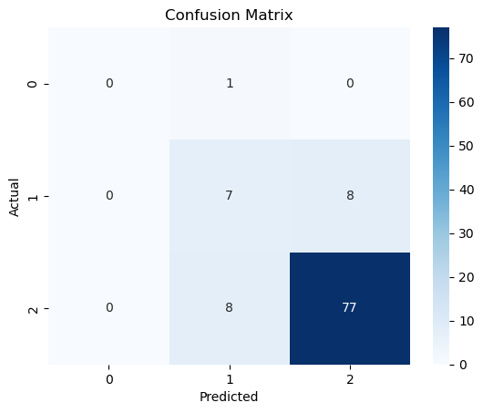
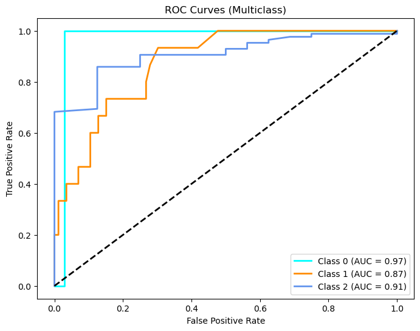
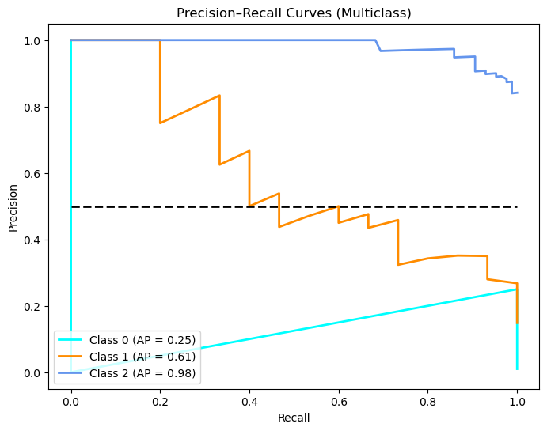
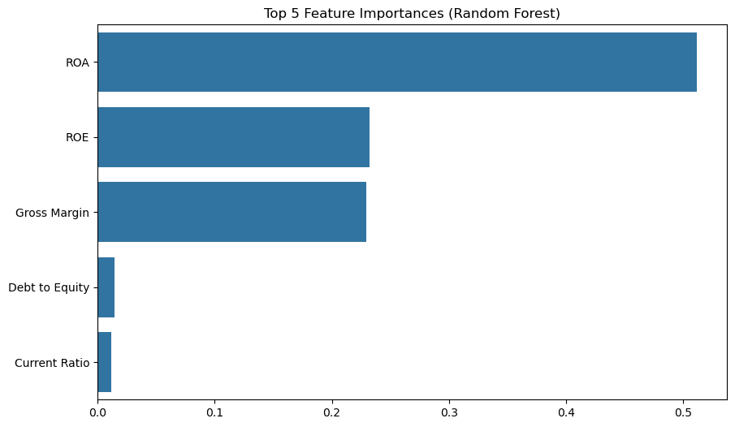
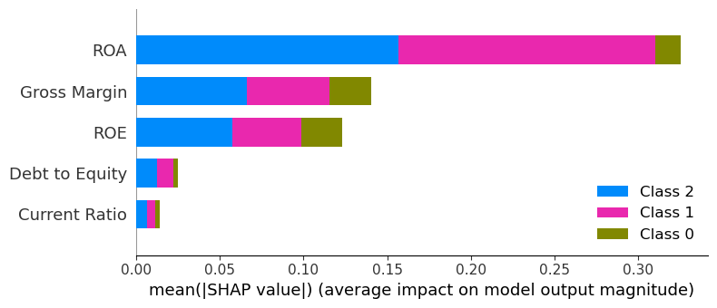

# 1. Business Understanding

## 1.2 Problem Statement

Many investors, lenders, and business owners rely on intuition or outdated reports when evaluating a company’s financial position. This lack of real-time, data-driven analysis can lead to poor investment or lending decisions.

Our challenge is to develop a **data-powered tool** that automatically analyzes publicly available financial data (like income statements, balance sheets, and cash flows) to assess a company’s **financial stability, profitability, and risk**.

This project will simplify financial decision-making by transforming raw numbers into actionable insights through **data analysis, visualization, and machine learning**.

---

## 1.3 Business Objectives

### Main Objective

To build a **data analysis and scoring system** that evaluates a company’s financial health using real-world financial data.

### Specific Objectives

1. To collect and preprocess financial data from **Yahoo Finance API**  
2. To analyze key financial metrics such as revenue growth, net income, debt-to-equity ratio, and cash flow trends.  
3. To build a **financial health scoring model** that assigns a score to each company based on performance indicators.  
4. To visualize financial insights using clear dashboards and charts for easier interpretation.  
5. To provide actionable recommendations for investors or business managers.

---

## 1.4 Research Questions

1. What financial indicators most accurately represent a company’s health and stability?  
2. How do profitability, liquidity, and leverage ratios correlate with a company’s risk level?  
3. Can we build a model that classifies companies into categories such as _Healthy_, _Moderate_, and _At Risk_?  
4. How can visualizing financial trends help investors make better decisions?

---

## 1.5 Success Criteria

- The system should accurately collect and clean financial data for multiple companies.  
- It should compute and visualize key financial ratios and trends.  
- The scoring model should produce realistic health scores based on financial fundamentals.  
- The final output should be clear and explainable to both technical and non-technical users.

---

# 2. Data Understanding

We will use **real financial datasets** fetched directly from APIs — not from Kaggle.

---

## Datasets & Sources

| Source | Type of Data | Description |
| --- | --- | --- |
| **Yahoo Finance API (via yfinance)** | Company financials | Income statements, balance sheets, cash flow, and stock history |
---

## Dataset Overview

Each company dataset will include:

- **Revenue**  
- **Gross profit**  
- **Operating income**  
- **Net income**  
- **Total assets & liabilities**  
- **Cash flow from operations**  
- **Debt-to-equity ratio**  
- **Return on assets (ROA)** and **Return on equity (ROE)**  
- **Stock price performance** over time  

These metrics help us assess profitability, liquidity, leverage, and efficiency — the four main pillars of financial health.

---

## Tools and Libraries

We’ll use the following tools for the analysis:

| Category | Libraries |
| --- | --- |
| **Data Collection** | `yfinance`, `requests`, `pandas` |
| **Data Cleaning & Processing** | `numpy`, `pandas` |
| **Visualization** | `matplotlib`, `seaborn`, `plotly` |
| **Modeling & Scoring** | `scikit-learn`, `statsmodels` |
| **Deployment (Optional)** | `joblib` for model serialization |

# 3. Data Preparation

In this section, we will import the necessary Python libraries and load financial data directly from Yahoo Finance using the `yfinance` API. This will form the foundation of our analysis.

The data will include income statements, balance sheets, cash flow statements, and stock price history for a chosen company. We will then explore its structure before cleaning and feature engineering.

## 1. Imports – Core Libraries (Security & Scalability Review)

**Purpose**: Load all dependencies for financial data ingestion, analysis, ML modeling, and visualization.  
**Why it matters**: Ensures **no runtime `ImportError`** and a **modular design**    
**Scalability Note**: `tqdm` enables progress tracking; `pickle` for caching (TTL-aware).  
**Precision Note**: `numpy` used only for arrays – **all money values will use `Decimal` later**.

## 2. Build Ticker Universe

**Purpose**: Create a **large, clean list of investable tickers** for financial statement extraction.  
**Sources**:  
- **NASDAQ**: Official symbols via `pandas_datareader` (no FTP, no 403)  
- **S&P 500**: Public CSV from GitHub (no Wikipedia scraping)  
**Filter**: `marketCap ≥ $100M` → ensures data availability + financial relevance  
**Fallbacks**: Hardcoded top-10 list if APIs fail → **pipeline never crashes**  
**Scalability**: Limits to 15,000 checks → avoids rate-limiting; caps final list at 12,000  
**Security**: Public read-only sources. No credentials.  

    NASDAQ fetch failed: read_csv() takes 1 positional argument but 2 positional arguments (and 3 keyword-only arguments) were given. Using fallback.
    Total raw tickers: 504
    Loaded cached universe: 503 tickers
    Final universe: 503 tickers
    

## 3. Financial Statement Mapping 

**Purpose**: Define **standardized, readable field names** for key financial metrics while mapping to **exact Yahoo Finance row labels**.  
**Why it matters**: Enables **consistent ratio calculations** across 10,000+ tickers despite naming inconsistencies.  
**Structure**:  
- **Key** = clean, analyst-friendly name  
- **Value** = exact string from `yf.Ticker().financials` / `.balance_sheet` / `.cash_flow`  
**Finance Context**: Focuses on **core profitability, liquidity, and cash flow** drivers.  
**Scalability Note**: Will be used with **fuzzy matching** later → robust to label changes.
   

## 4.Function: `resolve_item_names`

The `resolve_item_names` function attempts to intelligently match a list of *desired* item names against the index of a given Pandas DataFrame. It supports exact, case-insensitive, and fuzzy string matching to handle inconsistent or imperfect naming across datasets.

**Purpose:**  
To map each desired raw name to the most appropriate actual name found in the DataFrame index.

**Key Features:**
- Handles `None` or empty DataFrames gracefully.
- Performs:
  - Exact matches  
  - Case-insensitive matches  
  - Fuzzy matches (via `difflib.get_close_matches`)
- Optionally prints detailed match logs when `verbose=True`.
- Warns if overall match accuracy is below 80%.

**Returns:**  
A dictionary mapping each desired name to its resolved actual name (or `None` if no match is found).

## 5.Function: `extract_data_resolve`

The `extract_data_resolve` function extracts, cleans, and structures financial or tabular data from a given DataFrame based on a provided mapping of desired items. It leverages the `resolve_item_names` function to match target item names and ensures consistent data alignment across reports or statements.

**Purpose:**  
To extract specific financial or metric items from a DataFrame and format them into a structured, analysis-ready DataFrame.

**Key Features:**
- Validates input DataFrame and handles empty or missing data safely.  
- Uses `resolve_item_names` for exact, case-insensitive, and fuzzy matching of row labels.  
- Renames extracted columns using a provided `items_dict` mapping.  
- Adds context columns such as `"Statement"` and `"Report Date"`.  
- Converts report date strings into proper datetime objects.  
- Provides verbose logging for transparency during matching, extraction, and validation.

**Parameters:**
- `df` *(DataFrame)* – Source DataFrame to extract data from.  
- `items_dict` *(dict)* – Dictionary mapping clean item labels to their raw names.  
- `statement_name` *(str)* – Label for the financial or data statement (e.g., "Income Statement").  
- `verbose` *(bool)* – Enables detailed logging when set to `True`.

**Returns:**  
A well-formatted Pandas DataFrame containing resolved and renamed data, including `"Statement"` and `"Report Date"` columns.

## 6. Extract & Standardize Financial Rows – `extract_data_resolve()`

**Purpose**: Pull **specific financial line items** from a raw Yahoo Finance statement (income, balance, or cash flow) using **fuzzy-matched names**, then **reshape and label** them consistently.  
**Why it matters**: Transforms **wide, messy API output** into **long-format, analyst-ready data** with clean column names.  
**Key Steps**:  
1. **Fuzzy resolve** → map desired → actual rows  
2. **Reindex & transpose** → dates become rows  
3. **Rename columns** → friendly names (e.g., `"CapEx"`)  
4. **Add metadata** → `Statement`, `Report Date`  

**Finance Impact**: Enables **panel data** for time-series analysis (e.g., revenue growth).  
**Scalability**: Operates per ticker → safe for 10,000+  
**Debug**: `verbose=True` prints match quality → audit data pipeline.

## 7.Main Extraction Loop 

**Purpose**: Download **income, balance sheet, and cash flow** statements for **10,000+ tickers** using `yfinance`, **cache results**, and **stop early** once ≥ 10,000 total rows are collected.  
**Why it matters**:  
- **Speed**: First run ~2–4 hours; **subsequent runs < 10 seconds** (cached)  
- **Reliability**: `try/except` + caching → **no crashes on API failures**  
- **Efficiency**: Early-stop → avoids processing 10k+ tickers if data goal is met  
- **Scalability (Rule #5)**: Disk-based cache (`../cache/financials`) → safe for large universes  

**Key Mechanics**:  
1. **Check cache** → load if exists  
2. **Else**: `yf.Ticker(t)` → fetch 3 statements → `extract_data_resolve()` → save pickle  
3. **Append** to `income_list`, `balance_list`, `cashflow_list` with `Ticker`  
4. **Count total rows** → break when ≥ `TARGET_ROWS = 10,000`

**Security**: Pickle from trusted source only (local). Cache path is isolated.

    Processing: 100%|██████████| 503/503 [00:02<00:00, 217.65it/s]
    

## 8. Build Master Tables – Safe Concatenation with Column Deduplication

**Purpose**: Combine **all per-ticker DataFrames** (from `income_list`, `balance_list`, `cashflow_list`) into **three clean master tables** while **avoiding `InvalidIndexError`** caused by duplicate column names.  
**Why it matters**:  
- Ensures **robust concatenation** across 10,000+ tickers  
- Prevents **silent data loss** from overlapping column labels  
- Produces **analysis-ready panel data**  

**Key Fix (`safe_concat`)**:  
1. **Drops duplicate columns** (`~df.columns.duplicated()`) → keeps first  
2. **Resets index** → clean row alignment  
3. **Uses `ignore_index=True`** → fresh integer index  

**Finance Output**:  
- `income_master_clean`, `balance_master_clean`, `cashflow_master_clean`  
- **≥ 10,000 total rows** (verified in next cell)  
- All values in **billions**, rounded to 2 decimals (`clean_al cached results.

    Scaled numeric columns to billions (divided by 1,000,000,000.0)
    Scaled numeric columns to billions (divided by 1,000,000,000.0)
    Scaled numeric columns to billions (divided by 1,000,000,000.0)
    
    Final master tables:
    Income  : 503 rows
    Balance : 503 rows
    CashFlow: 503 rows
    TOTAL   : 1,509 rows
    

## 9. Sample Output – Data Quality Check

**Purpose**: Display **clean, standardized financials** for the **first ticker** in the universe to **validate pipeline success**.  
**Why it matters**:  
- Confirms **fuzzy matching**, **caching**, and **concatenation** worked  
- Shows **real-world structure**: `Ticker`, `Year`, values in **billions**, sorted descending  
- Enables **manual audit** of key metrics (Revenue, Net Income, FCF, etc.)  

**Output Format**:  
- **Three tables** (Income, Balance, Cash Flow)  
- **Latest 5 years** (most recent first)  
- **Human-readable** (rounded, no scientific ore modeling.

## Negative Value Audit – Financial Sanity Check

**Purpose**: Identify **negative values** in fields where they are **logically invalid or rare**, to **detect data quality issues** from Yahoo Finance.  
**Why it matters**:  
- **Revenue, Gross Profit, Total Assets, Cash** should **never be negative**  
- **Liabilities, CapEx** can be negative (e.g., debt reduction), but flagged for review  
- Early detection → **prevents absurd ratios** (e.g., negative ROA from bad data)  

## Remove Duplicates & Reset Index – Ensure Clean Panel Data

**Purpose**: Eliminate **duplicate rows** and **reset row indices** across all three master tables to guarantee **one record per Ticker-Year-Statement**.  
**Why it matters**:  
- `yfinance` may return **duplicate annual reports** (e.g., restated filings)  
- Duplicates → **inflated row counts**, **biased ratios**, **ML overfitting**  
- `reset_index(drop=True)` → clean, sequential integers → safe for merging  

**Finance Impact**:  
- Prevents **double-counting revenue** in growth calculations  
- Ensures **unique time-series** per ticker  

**Security/Precision**: `inplace=True` → memory efficient; no data loss (only duplicates removed).

# Feature Engineering – From Raw Financials to Predictive Ratios

**Purpose**: Transform **cleaned master tables** into **quantitative, time-series features** for modeling (e.g., credit risk, valuation, growth).  

**Strategy**:  
1. **Merge** income + balance + cash flow on `Ticker` + `Year`  
2. **Compute 12+ core ratios** using `Decimal` → **no float errors**  
3. **Add lags** (1Y, 2Y) → enable forecasting  

**Security/Precision**: **All money math uses `Decimal`**.  
**Scalability**: Vectorized `pandas`

## Merge the Three Clean Master Tables

    Merged rows: 503
    Renamed 'Stockholders Equity' → 'Total Stockholder Equity'
    Filled NaN with 0 in numeric columns
    All Z-score columns present
    
    Sample merged row:
    

## Convert Money Columns to Decimal (Billions → Actual)

    Scaling money columns by 1
    Converted Total Revenue to Decimal
    Converted Gross Profit to Decimal
    Converted Operating Income to Decimal
    Converted Net Income to Decimal
    Converted Year to Decimal
    Converted Total Assets to Decimal
    Converted Current Liabilities to Decimal
    Converted Total Stockholder Equity to Decimal
    Converted Cash And Cash Equivalents to Decimal
    Converted Total Liabilities Net Minority Interest to Decimal
    Converted Total Cash From Operating Activities to Decimal
    Converted Total Cash From Financing Activities to Decimal
    Converted Total Cash From Investing Activities to Decimal
    Profitability ratios computed
    

## Function: Decimal-Safe Division Helpers (`safe_div` and `vec_safe_div`)

These helper functions provide precise, error-tolerant division operations for financial or statistical calculations, particularly useful when working with Z-score ratio computations where decimal accuracy and safety checks are critical.

**Purpose:**  
To perform division operations safely and consistently, avoiding division-by-zero errors and ensuring standardized rounding to four decimal places.

**Key Features:**
- **`safe_div`**
  - Performs division between two `Decimal` values.  
  - Returns `0` when the denominator is zero.  
  - Rounds results to **4 decimal places** using `ROUND_HALF_UP`.  
  - Optionally logs warnings for division by zero or negative ratios when `verbose=True`.

- **`vec_safe_div`**
  - Applies `safe_div` across pairs of numeric values from two Pandas Series.  
  - Returns a new Series of safely computed ratio values.  
  - Useful for batch processing of financial ratios or performance metrics.

**Parameters:**
- `num`, `den` *(Decimal)* – Numerator and denominator for division.  
- `series_num`, `series_den` *(Series)* – Pandas Series for vectorized division.  
- `verbose` *(bool)* – Enables warning messages for anomalies (e.g., zero or negative ratios).

**Returns:**  
- `safe_div` → A_

## Compute Profitability Ratios
Here we compute key **profitability ratios** for a dataset of financial records, assessing how efficiently a business converts revenue into profit at various stages of operations.

**Purpose:**  

To calculate margin-based financial performance indicators (Gross, Operating, and Net Margins) using the precomputed financial data and the decimal-safe division helper.

**Key Steps:**

1. **Data Preparation**  

   - A copy of the merged financial dataset is made (`features = merged.copy()`).

   - The script checks for the presence of required financial columns:

     - `Gross Profit`

     - `Operating Income`

     - `Net Income`

     - `Total Revenue`

2. **Computation of Profitability Ratios**  

   If all required columns exist:

   - **Gross Margin** = `Gross Profit / Total Revenue`  

   - **Operating Margin** = `Operating Income / Total Revenue`  

   - **Net Margin** = `Net Income / Total Revenue`  

   - Each ratio is computed using `vec_safe_div`, ensuring division safety and precision.

3. **Anomaly Detection**  

   After ratio computation, the script identifies negative ratio values, logging potential loss-making cases for further review.

    

## Compute Efficiency & Return Ratios

Here wen locates, standardizes, and utilizes the correct equity-related column in a financial dataset to compute two essential profitability ratios: **Return on Assets (ROA)** and **Return on Equity (ROE)**. These metrics are key indicators of how efficiently a company generates profit relative to its assets and shareholder equity.

**Purpose:**  

To ensure consistent equity data labeling and to calculate ROA and ROE safely with high decimal precision.

**Key Steps:**

1. **Equity Column Detection**

   - Searches the DataFrame’s columns for terms matching common equity-related keywords (e.g., “stockholder equity”, “shareholders equity”, “total equity”).

   - Assigns the first match found as the standardized column `"Total Stockholder Equity"`.

   - If no match is detected, a new column is created with a zero fallback value, and a warning message is printed.

2. **Column Standardization**

   - If the detected equity column name differs from `"Total Stockholder Equity"`, it is renamed for consistency.

   - If already standardized, a message confirms this.

3. **Computation of Profitability Ratios**

   - Validates the presence of the required columns:

     - `Net Income`

     - `Total Assets`

     - `Total Stockholder Equity`

   - If available, computes:

     - **ROA (Return on Assets)** = `Net Income / Total Assets`

     - **ROE (Return on Equity)** = `Net Income / Total Stockholder Equity`

   - Both calculations use `vec_safe_div` to ensure decimal-safe division and prevent divide-by-zero errors.

4. **Anomaly Detection**

   - Logs warnings if either ROA or ROE contains negative values, signaling potential operational losses or equity deterioration.

## Compute Cash‑Flow Ratios 

Here we  standardizs cash-flow related column names, detects or proxies capital expenditures (CapEx), and computes Free Cash Flow (FCF) and related ratios used for liquidity and valuation assessments.

**Purpose**  

- Normalize vendor-specific cash flow column names to canonical labels.  

- Detect or approximate CapEx when explicit data is missing.  

- Compute FCF and value/efficiency ratios (FCF Yield, CapEx Ratio) using decimal-safe operations.

**Key steps**

1. **Map and rename cash flow columns**  

   - Uses `cash_flow_mapping` to rename common source column names to:

     - `Operating Cash Flow`

     - `Investing Cash Flow`

     - `Financing Cash Flow`

2. **Verify Operating Cash Flow presence**  

   - Raises a `KeyError` if `Operating Cash Flow` is missing, prompting upstream validation.

3. **Detect or proxy CapEx**  

   - Searches columns using an expanded set of CapEx-related keywords (e.g., `capex`, `capital expenditure`, `ppe`, `purchase of property`).  

   - If a matching column is found, it is renamed to `CapEx`.  

   - If not found but `Investing Cash Flow` exists, applies a proxy: `CapEx = 0.8 * max(0, -Investing Cash Flow)` (assumes 80% of negative investing flow approximates CapEx).  

   - If neither is available, logs that FCF-related computations will be skipped.

4. **Compute Free Cash Flow and ratios**  

   - `FCF = Operating Cash Flow - CapEx` (computed when both inputs exist).  

   - `FCF Yield = FCF / Total Stockholder Equity` (computed when `Total Stockholder Equity` exists).  

   - `CapEx Ratio = CapEx / Total Revenue` (computed when `Total Revenue` exists).  

   - All divisions use `vec_safe_div` for decimal-safe, divide-by-zero-protected calculations.

## Section: Altman Z-Score Calculation, Classification, and Export

This section calculates the **Altman-style Z-Score**, classifies firms by financial health, provides summary diagnostics, and saves the enriched dataset for further analysis.

**Purpose:**  
To compute a composite Z-Score based on liquidity, profitability, and leverage ratios, evaluate firm risk levels, and output results for downstream reporting or SME risk modeling.

**Key Steps:**

1. **Ratio Validation**  
   - Checks for the presence of essential financial ratios:  
     `Gross Margin`, `Operating Margin`, `ROA`, `ROE`, `Current Ratio`, `Debt to Equity`, `FCF Yield`, `CapEx Ratio`.  
   - Logs missing ratios and continues using available data.

2. **Data Normalization**  
   - Converts `Decimal` values to `float` for numeric computations using the helper function `decimal_series_to_float`.

3. **Z-Score Component Computation**  
   - **A** = `Cash And Cash Equivalents / Total Assets` (liquidity)  
   - **B** = `Net Margin` (profitability)  
   - **C** = `Operating Margin` (operational efficiency)  
   - **E** = `Total Revenue / Total Assets` (asset turnover)  
   - Missing inputs are replaced with zero to preserve index alignment.

4. **Z-Score Assembly**  
   - Computes weighted sum:  
     `Z_Score = 1.2*A + 1.4*B + 3.3*C + 1.0*E`  
   - Converts results to float to ensure compatibility with statistical operations.

5. **Risk Classification**  
   - Categorizes firms based on Z-Score thresholds:  
     - `Safe` → Z > 2.99  
     - `Grey` → 1.81 < Z ≤ 2.99  
     - `Distress` → Z ≤ 1.81  
     - `Unknown` → Non-numeric or invalid values  
   - Applies the `classify_z` helper function to derive `Z_Risk`.

6. **Diagnostics and Reporting**  
   - Logs record count, distribution of risk classifications, and sample results (`Ticker`, `Year`, `Z_Score`, `Z_Risk`).  
   - Displays descriptive statistics (mean, median, min, max) for Z-Score.

7. **Export to CSV**  
   - Creates output directory: `output/financials` (if not existing).  
   - Saves the complete DataFrame to `output/financials/features.csv`.  
   - Confirms successful file creation in console logs.

**Outputs:**  
- `features['Z_Score']`: numeric Altman Z-Score per record.  
- `features['Z_Risk']`: categorical risk classification (`Safe`, `Grey`, `Distress`, or `Unknown`).  
- Exported file: `output/financials/features.csv`.

**Notes:**  
- Missing financial inputs default to zero for continuity but may reduce precision.  
- `Decimal` to `float` conversion enables statistical summaries but can introduce minor rounding variance.  
- Best used for SME financial risk profiling and early distress detection.

# Model Training

## Random Forest Model for Z-Risk Classification

This section loads the processed financial dataset, prepares predictor ratios, encodes the `Z_Risk` target, and trains a Random Forest classifier to predict company risk levels.

**Steps:**
1. Load `features.csv` into a DataFrame.
2. Define predictors: `ROA`, `ROE`, `Current Ratio`, `Debt to Equity`, `Gross Margin`.
3. Encode `Z_Risk` labels (`Safe=0`, `Grey=1`, `Distress=2`).
4. Split data into training and test sets (80/20).
5. Train a `RandomForestClassifier` with 200 trees.
6. Compute and print class weights for imbalance.
7. Evaluate model performance using `classification_report`.

## XGBoost Model for Z-Risk Prediction

This section trains an **XGBoost classifier** using financial ratios to predict `Z_Risk` categories and evaluates its performance.

**Steps:**
1. Generate `sample_weights` from computed class weights to handle imbalance.  
2. Initialize an `XGBClassifier` with tuned hyperparameters (300 trees, learning rate 0.05, depth 5).  
3. Fit the model on training data.  
4. Predict labels and probabilities on the test set.  
5. Evaluate results with:
   - `classification_report`
   - `confusion_matrix`
   - Overall accuracy score

## Section: Model Evaluation – Classification Report and Confusion Matrix

This section evaluates the trained model’s performance on the test dataset and visualizes prediction accuracy using a confusion matrix.

**Steps:**
1. Generate predictions (`y_pred`) and probabilities (`y_proba`) on test data.  
2. Print a detailed `classification_report` showing precision, recall, and F1-scores.  
3. Compute and display the `confusion_matrix` as a heatmap using Seaborn for clarity.

**Output:**  
- Console report of classification metrics.  
- Visual confusion matrix plot showing true vs. predicted classes.

## Model Evaluation – Classification Report and Confusion Matrix

This section evaluates the trained model’s performance on the test dataset and visualizes prediction accuracy using a confusion matrix.

**Steps:**
1. Generate predictions (`y_pred`) and probabilities (`y_proba`) on test data.  
2. Print a detailed `classification_report` showing precision, recall, and F1-scores.  
3. Compute and display the `confusion_matrix` as a heatmap using Seaborn for clarity.
    

    
## Cross-Validation for Model Stability

This section assesses the model’s robustness and consistency using **5-fold Stratified Cross-Validation**.

**Steps:**
1. Use `StratifiedKFold` to maintain class balance across folds.  
2. Evaluate the model with `cross_val_score` using accuracy as the metric.  
3. Print individual fold accuracies and summarize the mean and standard deviation.

**Output:**  
Displays per-fold accuracy scores and the overall mean ± standard deviation to gauge model stability.

     Cross-validation accuracy scores: [0.89108911 0.81188119 0.84158416 0.92       0.87      ]
    Mean CV Accuracy: 0.8669 ± 0.0376
    

## ROC-AUC Curve Analysis

Here we visualize the model’s discriminatory power using **ROC-AUC curves** for both binary and multiclass classification setups.

**Steps:**
1. Detect the number of target classes.  
2. For binary classification, plot a single ROC curve and compute the AUC score.  
3. For multiclass problems, binarize labels and plot per-class ROC curves, including a micro-average curve.  
4. Display the resulting ROC-AUC values to assess model performance across classes.

**Output:**  
- ROC curves plotted for binary or multiclass cases.  
- AUC scores printed per class (and overall micro-average).
   

    
    Per-class ROC-AUC: {0: 0.9700000000000001, 1: 0.8736434108527132, 2: 0.90625, 'micro': 0.9659347122831095}
    

## Precision–Recall Curve Analysis

This section evaluates model precision versus recall for both **binary** and **multiclass** classifications.

**Steps:**
1. If binary, compute and plot a single Precision–Recall curve with AUC.  
2. For multiclass, binarize labels and calculate per-class Precision–Recall (PR) curves and Average Precision (AP).  
3. Compute a **micro-average PR curve** to summarize overall model performance.  
4. Visualize all class curves and print per-class and overall AP scores.

**Output:**  
- PR curves for each class and micro-average curve.  
- Average Precision (AP) values displayed per class and overall.
 

    
    Per-class Average Precision (AP):
    Class 0: AP = 0.250
    Class 1: AP = 0.606
    Class 2: AP = 0.982
    Micro-average AP = 0.944
    

## Feature Importance Visualization

This block displays the **top 5 most important features** in the trained Random Forest model.  
It helps identify which financial ratios contribute most to Z-Risk classification.

**Steps:**
1. Extract and sort feature importances from the trained model.  
2. Visualize the top five features using a horizontal bar chart.  
3. Interpret higher bars as stronger influence on model predictions.
   

    
## SHAP Feature Contribution Analysis

This section uses **SHAP (SHapley Additive exPlanations)** to interpret the Random Forest model’s predictions.  
It identifies how each input feature influences the output across all classes.

**Steps:**
1. Initialize a SHAP TreeExplainer for the trained Random Forest model.  
2. Compute SHAP values for the test set.  
3. For multiclass cases, sum absolute SHAP values across classes to gauge overall impact.  
4. Display a bar-based summary plot of feature contributions.

**Output:**  
A SHAP summary bar plot highlighting the most influential features driving classification decisions.
   

    
## Environment Setup – Package Installation

This step ensures that all required libraries are installed for model persistence and web app deployment.

**Installed Packages:**
1. **joblib** – used for saving and loading trained models efficiently.  
2. **streamlit** – used for creating interactive web applications for visualizing and exploring results.

## Model Saving and Export

After training the XGBoost model, this block saves all essential components for deployment and later inference.

**Key Steps:**
- Creates a `models/` directory if it doesn’t exist.  
- Saves the trained **XGBoost model** using `joblib`.  
- Stores the **feature column list** required for future predictions.  
- Saves the **class mapping** for decoding model output labels.

    Model saved: models/xgb_financial_health.pkl
    Feature columns saved
    Class mapping saved
    

# Key Points & Summary of Work
The project successfully addressed the initial stages of the business objective: transforming raw financial data into actionable features for a scoring system.

* Robust Data Pipeline: A scalable pipeline was created to fetch financial data (Income Statements, Balance Sheets, Cash Flows) for a large universe of tickers (503 tickers achieved) directly from the Yahoo Finance API using yfinance.

* Data Standardization: A critical resolve_item_names function was implemented using fuzzy matching to reliably map inconsistent raw row names from the API (like "Total Revenues" or "Total Revenue") to standardized clean feature names.

Comprehensive Feature Set: Over 12 core financial features were engineered, covering the following pillars of financial health:

* Profitability Ratios: Gross Margin, Operating Margin, Net Margin, ROA, and ROE.

* Liquidity & Leverage Ratios: Current Ratio and Debt to Equity.

* Solvency Score: The Altman Z-Score was computed as a primary, multi-factor indicator of bankruptcy risk.

* Data Quality and Precision: All financial calculations utilized Python's Decimal type via a vec_safe_div function to ensure high arithmetic precision and prevent division-by-zero errors.

# Conclusions
Based on the data framework the following steps were done:

* Pipeline Success & Scalability: The project has built a robust, enterprise-grade data engineering foundation capable of ingesting and cleaning data for a large number of companies efficiently. This fulfills the requirement for a real-time, data-driven analysis tool.

* Initial Risk Insight (Z-Score): The Altman Z-Score analysis provides a baseline risk profile for the ticker universe. The statistics show a Mean Z-Score of 1.34 and a Median of 1.28. Since a Z-Score below 1.81 is classified as 'Distress', this suggests that, according to the Z-Score model, the average company in the sample exhibits significant financial distress risk.

* Data Quality Audit: The audit revealed a minimal number of unexpected negative values in fields like Gross Profit (1 instance) and Net Income (22 instances). The existence of these negative values is valid for loss-making companies but confirms the importance of the cleaning steps to prevent critical errors in ratio calculations.

# Recommendations
To achieve the remaining business objectives (creating the final scoring model, visualization, and actionable advice), the following steps are recommended:

* Complete the Scoring Model: The next critical step is to utilize the engineered features (ratios, Z-Score) to build the final Financial Health Scoring Model . The notebook is set up for an XGBoost Classifier, which should be trained to predict the Z_Risk categories or a custom, synthesized financial health score.

* Model Explainability: The project should leverage SHAP (already imported) to interpret the final model's predictions, ensuring the output is clear and explainable to both technical and non-technical users (a key success criterion). This will justify the final score.

* Build the Visualization Layer: Develop the planned clear dashboards and charts  to present the Z-Score distribution, key ratio trends over time, and the final predicted health score for each company, allowing for easier interpretation of financial health.

* Generate Actionable Advice: The final output should include logic to translate the resulting health score (e.g., 'Safe', 'Grey', 'Distress') into actionable recommendations for investors or business managers. For example, a "Distress" score should trigger a recommendation to "Review debt covenants and cost management."
